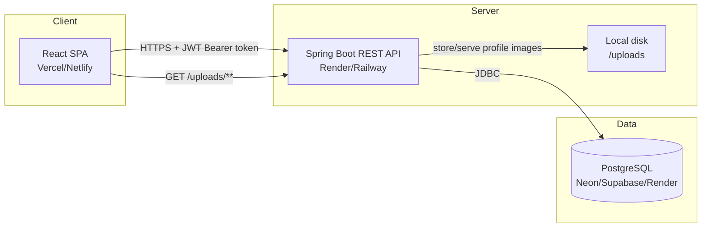
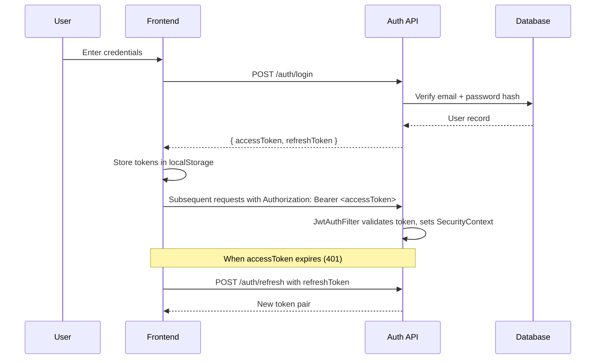

# Architecture

## System Overview



## Backend Layering

```
HTTP Request
     │
     ▼
┌─────────────┐   validates input (Bean Validation),
│ Controller   │   delegates to service, maps HTTP status
└─────────────┘
     │
     ▼
┌─────────────┐   business rules, transactions,
│  Service     │   orchestrates repositories + mappers
└─────────────┘
     │
     ▼
┌─────────────┐   Spring Data JPA + Specifications
│ Repository   │   for dynamic search/filter
└─────────────┘
     │
     ▼
┌─────────────┐
│  PostgreSQL  │
└─────────────┘
```

Entities **never** cross the controller boundary — every response is a DTO built by a dedicated `mapper` class. This keeps the JPA entity graph (lazy associations, bidirectional relationships) from ever being serialized directly, which is a common source of `LazyInitializationException`s and accidental data leaks in less careful implementations.

## Authentication Flow



- **Access token**: 1 hour expiry, sent on every request
- **Refresh token**: 7 day expiry, used only to mint new access tokens
- The axios interceptor on the frontend transparently catches `401`s, refreshes once, retries the original request, and queues any other concurrent requests until the refresh completes — so a burst of simultaneous API calls doesn't trigger multiple refresh calls.

## Security Layers (defense in depth)

1. **URL-level** — `SecurityConfig` restricts `/dashboard/**` and `/audit-logs/**` to `ADMIN` only at the filter chain level, before the request even reaches a controller.
2. **Method-level** — `@PreAuthorize("hasRole('ADMIN')")` on individual controller methods (e.g. employee create/update/delete) as a second, explicit check.
3. **Data-level** — services validate ownership/business rules (e.g. a department with assigned employees cannot be deleted).

## Why JPA Specifications for search

Employee search needed to combine: free-text search (name/email/code), department filter, and status filter — any combination of which might be present or absent. Rather than write a combinatorial set of repository query methods (`findByDepartmentAndStatus`, `findByNameContainingAndStatus`, etc.), `EmployeeSpecification.filterBy()` builds the `WHERE` clause dynamically from whichever parameters are non-null. This is the same pattern you'd reach for in any real admin search UI.

## Error Handling Strategy

A single `@RestControllerAdvice` (`GlobalExceptionHandler`) maps every exception type to a consistent `ApiError` JSON shape (`status`, `error`, `message`, `path`, `timestamp`, and optional field-level `validationErrors`). This means the frontend only ever has to handle one error response shape, and no stack trace or internal detail is ever leaked to the client — the catch-all handler for unexpected exceptions returns a generic message while the real exception is still logged server-side.
