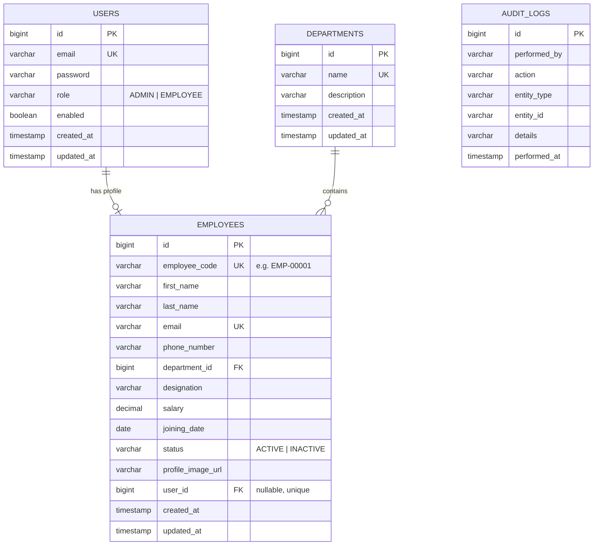

# Database Schema

PostgreSQL, 4 core tables. All tables use `IDENTITY` primary keys and `created_at`/`updated_at` audit columns (except `audit_logs`, which is append-only and immutable).

## Entity-Relationship Diagram

## Design Notes

- **`users` vs `employees`** — kept as two tables linked 1:1 (`employees.user_id`) rather than one. Authentication concerns (password hash, enabled flag, role) shouldn't live on the same row as HR data (salary, designation) — different lifecycle, different access patterns, different sensitivity.
- **`employee_code`** is a human-readable business key (`EMP-00001`) distinct from the numeric primary key — primary keys should never be exposed as "the" identifier a user types or searches by.
- **`department_id` is nullable** — self-registered employees start without a department/designation until an admin completes their profile; this avoids a placeholder "Unassigned" department row.
- **Indexes** on `employees.email` and `employees.status` since those are the most common search/filter columns; `employee_code` and `email` are unique constraints, which Postgres backs with indexes automatically.
- **`audit_logs` has no FKs** — it intentionally stores `entity_type` + `entity_id` as plain strings rather than foreign keys, since audit history must survive even if the referenced employee/department is later deleted.

## Sample Seed Data

On first startup, `DataSeeder` creates:
- 1 admin user (`admin@ems.com`)
- 5 departments (Engineering, HR, Sales, Marketing, Finance)
- 8 sample employees distributed across departments with realistic joining dates (for the growth chart to have real data)
